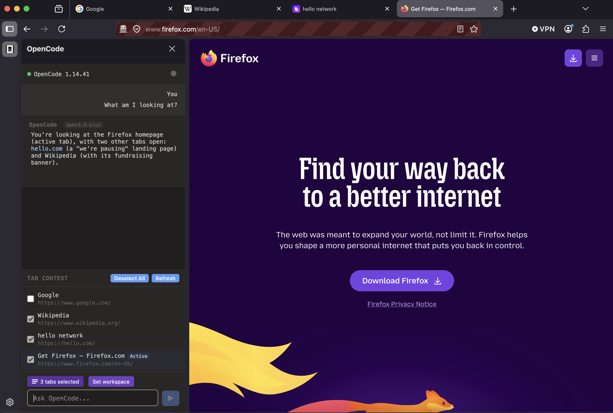
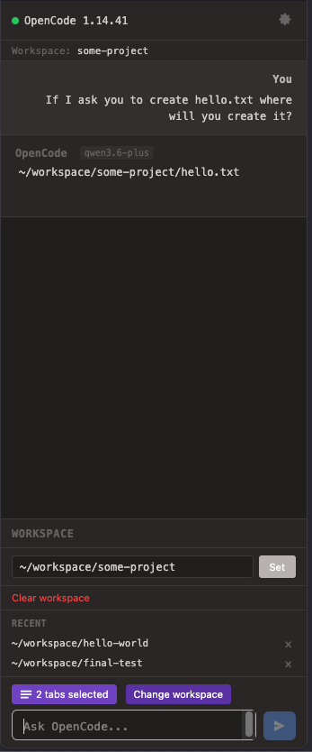
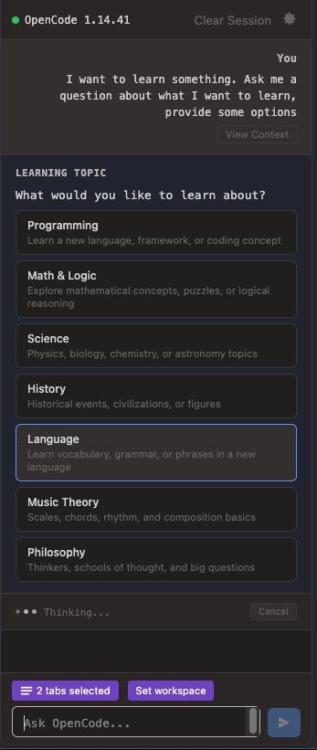

# OpenCode Firefox Extension

A Chrome and Firefox sidebar extension that integrates with [OpenCode](https://opencode.ai). Helpful for adding browser context to prompts.

## Features

* Tab Context — Select open browser tabs to include their content as context.
* Workspaces
  * Select a directory on your filesystem to scope the agent's changes to.
  * Sessions are automatically scoped to workspaces, keeping project conversations separate
  * Switch between recently used workspaces with configurable history.
* OpenCode Basic Auth support - Supports auth via `opencode serve OPENCODE_SERVER_PASSWORD=<pwd>`.
* Developer Mode - View context sent with each message and clear sessions.

## Screenshots

### Tab Context



### Workspace Selection



### Question & Answer



## Requirements
- Firefox 109 or later
- OpenCode server running locally (default: `http://localhost:4096`)

## Installation
*addons.mozilla.org submission is pending*

### Developer Installation

```bash
git clone https://github.com/anomalyco/opencode-firefox.git
cd opencode-firefox
npm install
```

## Usage

1. Start the OpenCode server: `opencode serve`
2. In a terminal run the dev build `npm run dev`
3. In another terminal run the extension `npx web-ext run`
4. In the browser open the extension sidebar and click the OpenCode icon
5. (Optional) Set a workspace directory by clicking the 'Set workspace' button
6. Select browser tabs to include as context
7. Type your prompt and press Enter or click Send

## Configuration

Click the settings gear icon to configure:

- **Server URL** — OpenCode server address (default: `http://localhost:4096`)
- **Server Username** — Authentication username (default: `opencode`)
- **Server Password** — Authentication password
- **Workspace History Size** — Number of recent workspaces to remember (default: 5)
- **Developer Mode** - toggle advanced developer-related tools

## Privacy

This extension stores data locally in your browser only:

- **Workspace paths** — Stored in `browser.storage.local` for quick re-selection
- **Session IDs** — Mapped to workspaces in `browser.storage.local` to keep conversations scoped
- **Server credentials** — Stored in `browser.storage.local` to avoid re-entering on each session

No data is sent to any server other than your local OpenCode instance. The extension does not collect, transmit, or share any telemetry or usage data.

## License

MIT
